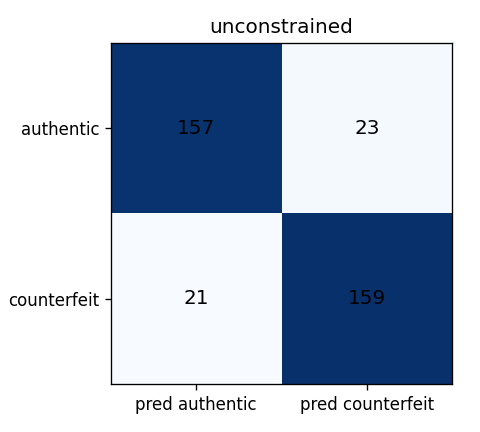
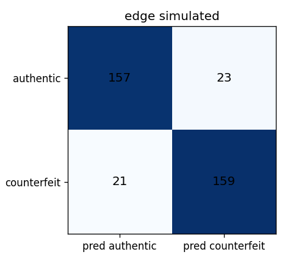
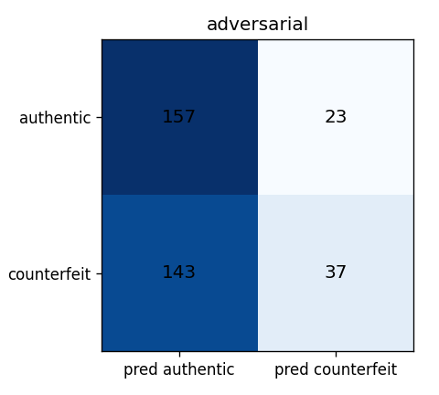

# Evaluation report

Generated 2026-09-18T06:29:56+00:00 · model `1.0.0` · manifest v1 · decision threshold D_W ≤ 0.480 = authentic

Targets (plan §10.2): Recall ≥ 0.95, Precision ≥ 0.85, Recall is the primary objective (a false negative is worse than a false positive).

## Results by condition

| Condition                                         | TP  | TN  | FP  | FN  | Precision | Recall | F1    | Gate |
| ------------------------------------------------- | --- | --- | --- | --- | --------- | ------ | ----- | ---- |
| Unconstrained (fp32, test split)                  | 159 | 157 | 23  | 21  | 0.874     | 0.883  | 0.878 | FAIL |
| Edge-simulated (fp16 weights, test split)         | 159 | 157 | 23  | 21  | 0.874     | 0.883  | 0.878 | FAIL |
| Adversarial (fp16, grade-A counterfeits held out) | 37  | 157 | 23  | 143 | 0.617     | 0.206  | 0.308 | FAIL |

Test pairs: 360 · adversarial pairs: 360 · images: 480

## Confusion matrices

## Inference latency (on-device)

_No device benchmark supplied. Run the PWA's `/bench` page on each device tier, download the JSON, and re-run `evaluate --latency-json <file>` to include p50/p95/p99 here._

## Dataset QA

Inter-rater agreement on audited subsample: 1.000 over 48 images (meets the ≥0.95 Objective 1 gate).
